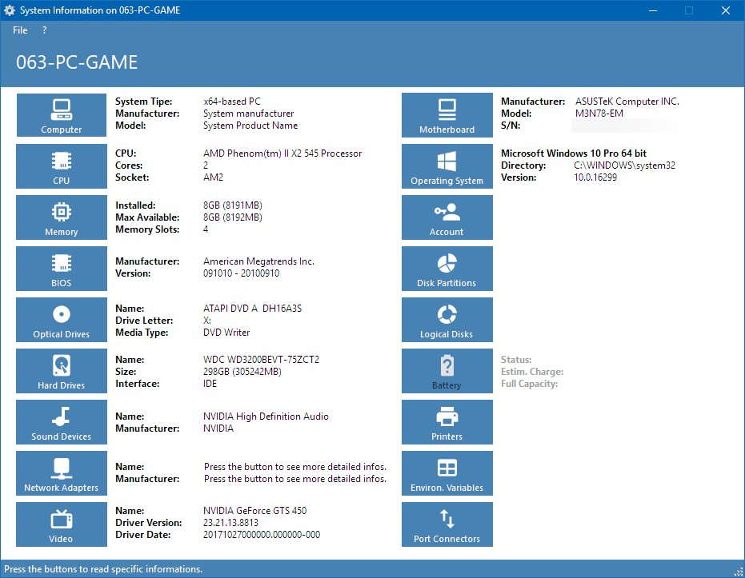

# Sys-Info
Sysinfo is a comprehensive tool that provides detailed information about different sectors of your Windows machine.

Once you open Sysinfo, it scans your machine and compiles different system information details. You can view information related to your processor, bios, operating system, hard drive, memory usage, optical drives, network adapters and more. Each of the sections provides some at-a-glance general information, but for each, the sector can be expanded allowing for a more in-depth look. Sysinfo also includes a section for battery details making it useful even for laptop users.

In closing, Sysinfo is a truly easy to use resource for those that like to keep informed about all aspects of their machine. 

- MajorGeeks.com

